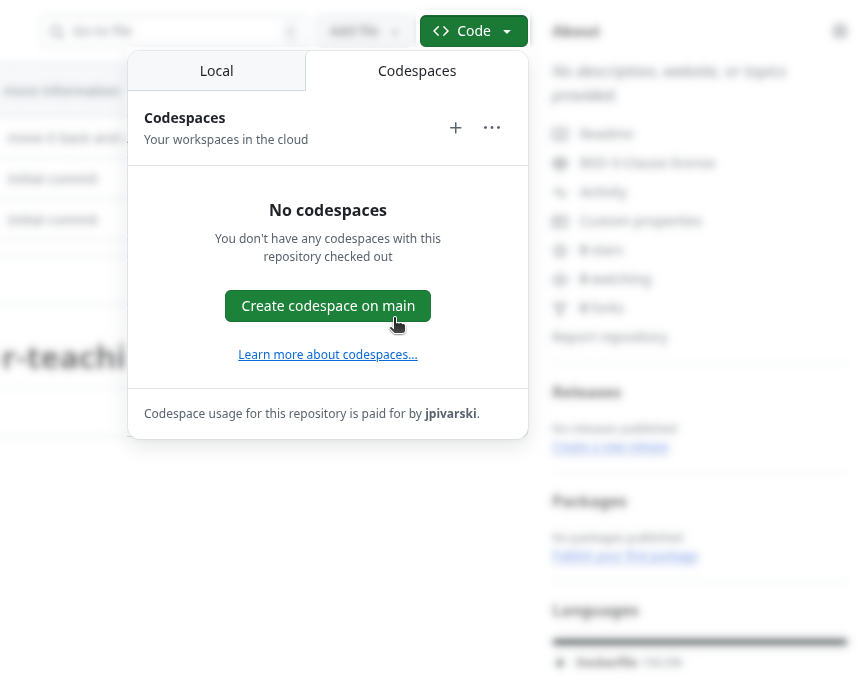
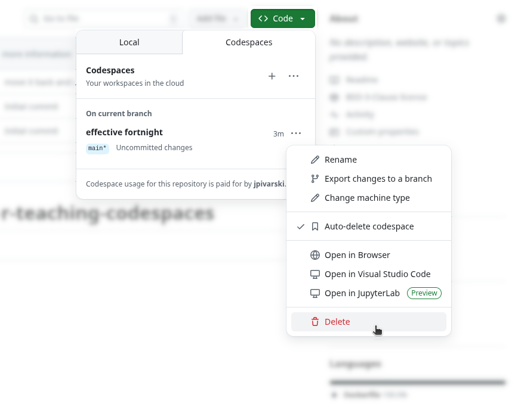
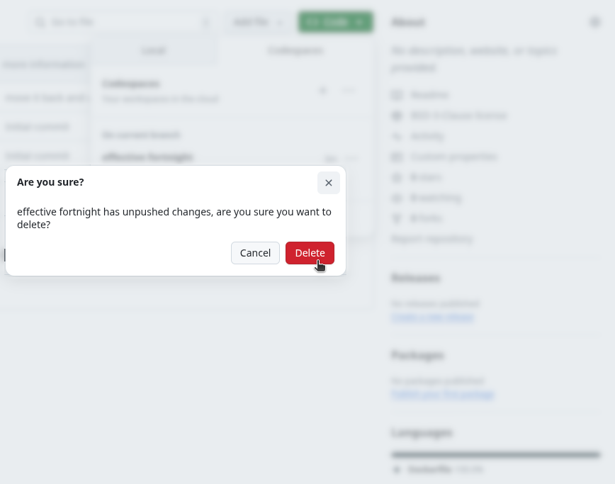

# Jupyter for Teaching (2025-09-11): Codespaces example

In this example, we launch Jupyter in GitHub Codespaces.

GitHub Codespaces runs code on a cloud with [120 free hours per month](https://docs.github.com/en/billing/concepts/product-billing/github-codespaces#free-and-billed-use-by-personal-accounts). You can rely on computational resources being available (it's backed by Microsoft), but
* if you or a student uses more than the free tier, usage is blocked until a credit card is entered—most of us have never done that, so even figuring out how to do it is a barrier (the price, [$0.18 per hour](https://github.com/pricing/calculator?feature=codespaces), is not too bad);
* like Binder, launching an instance can take several minutes, depending on whether you install any large packages (though [pre-built images can be cached](https://docs.github.com/en/packages/learn-github-packages/configuring-a-packages-access-control-and-visibility#ensuring-github-codespaces-access-to-your-package) to speed this up);
* students have to perform multiple steps before they get to the Jupyter interface.

## How to set up the repository

As a teacher, you need to set up a public repository like this one. Students start with the next section, "How to run a Codespaces instance".

All of the configuration goes in a [.devcontainer](https://github.com/jpivarski-talks/2025-09-11-jupyter-for-teaching-codespaces/tree/main/.devcontainer) directory, and all of your Jupyter notebooks (ipynb files) go in the main directory or subdirectories according to how you want to organize them.

```
.
├── .devcontainer
│   ├── devcontainer.json
│   ├── Dockerfile
│   └── requirements.txt
├── example-notebook.ipynb
├── LICENSE
└── README.md
```

The [devcontainer.json](https://github.com/jpivarski-talks/2025-09-11-jupyter-for-teaching-codespaces/blob/main/.devcontainer/devcontainer.json) tells Codespaces how to configure the instance—in this example, I set it to build a Docker image and run `jupyter lab` with a port open so that we can view it from a web browser. The [Dockerfile](https://github.com/jpivarski-talks/2025-09-11-jupyter-for-teaching-codespaces/blob/main/.devcontainer/Dockerfile) installs `jupyterlab`, `jupyterlab-deck`, and everything in [requirements.txt](https://github.com/jpivarski-talks/2025-09-11-jupyter-for-teaching-codespaces/blob/main/.devcontainer/requirements.txt). If you need to install from conda instead of pip, you would add `RUN` lines to install [Miniforge](https://conda-forge.org/download/) and use an [environment.yml](https://docs.conda.io/projects/conda/en/latest/user-guide/tasks/manage-environments.html) instead of `requirements.txt`. The example in this repository is the _simplest_ case.

When setting up your own GitHub repository, you do not need to turn on GitHub Pages or add any GitHub Actions in "Settings", as you need to with other Jupyter installations. All you need is a plain repository with the right files in it.

## How to run a Codespaces instance

### Step 1

Click on the green "Code" button, but instead of selecting a "Local" URL, click on the "Codespaces" tab and "Create codespace on main".



### Step 2

This automatically opens a new tab that looks like VSCode, in which the devcontainer/Dockerfile you specified starts building. If you click on the "Building codespace..." link, you can see the terminal output as it builds. That's useful for debugging if something goes wrong.

**This step takes several minutes.** During that time, students might think they need to click on one of the VSCode icons—they don't, and this complexity is one of the downsides of using Codespaces for Jupyter. It's primarily intended as a code-editing environment, but we're using it as a platform to run JupyterLab.

**You'll know it has finished building when progress bars are no longer streaming and the repository's README appears in the main window.**


### Step 3

When it finishes building, you (and the students) need to _go back_ to the original tab, maybe refresh the page, open the "..." menu, and click on "Open in JupyterLab".

(GitHub creates a random but memorable name for the instance; "effective fortnite" was randomly generated in the example below.)


### Step 4

Now JupyterLab is running in a new tab, and you can treat this as a normal JupyterLab installation, except that it's running on GitHub/Microsoft's servers instead of your own computer.

(The tab containing the VSCode-like view can be closed.)


### Step 5

When you and your students are done, the instance does not stop running, even if you select "Shut down" from JupyterLab's "File" menu.

**If students do not manually turn off their instance, it will use up minutes in their free tier and they'll have to pay if they run out and want to keep using it.**

Turn off the instance with "Stop codespace" in the "..." menu.


### Step 6

Although the instance has been stopped and is no longer costing compute time, the instance is storing data on GitHub/Microsoft's servers, which also has a small cost. This data consists of any files the students created or changed while running the instance. It can be deleted with "Delete" in the "..." menu.




